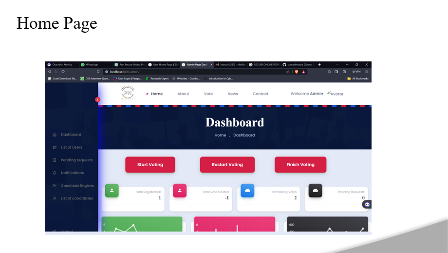
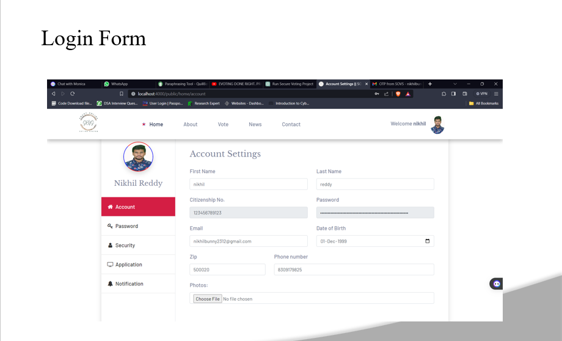
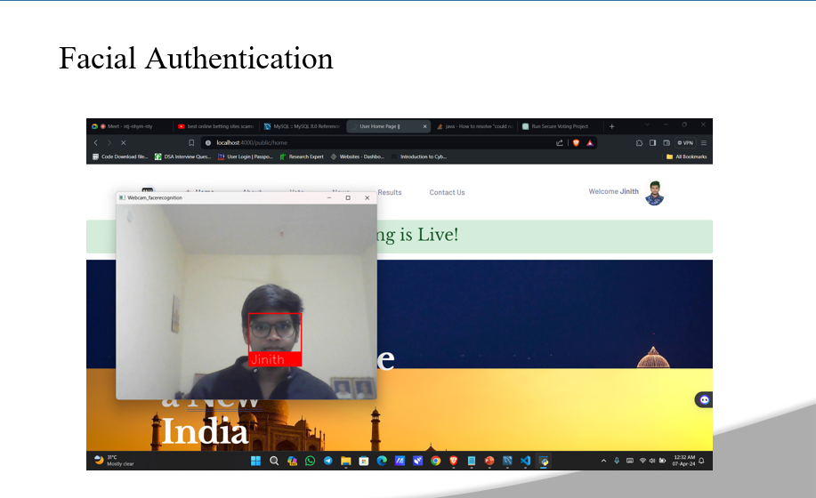

# BLOCKCHAIN-BASED-DECENTRALIZED-VOTING-SYSTEM-WITH-SHA-256-ALGORITHM-AND-FACIAL-RECOGNITION

This project is a decentralized voting system designed to provide a secure, transparent, and efficient voting process. The system uses blockchain technology to ensure that votes cannot be tampered with or altered, enhancing the integrity and reliability of elections.

## Objectives

- *Transparency and Verifiability*: Ensures all transactions, including votes, are transparent and immutable.
- *Security*: Protects against censorship and fraud.
- *Privacy*: Maintains voter anonymity.
- *Accessibility*: Increases voter participation by being accessible to anyone with an internet connection.
- *Cost-effectiveness*: Reduces costs associated with traditional voting processes.
- *Scalability*: Handles high volumes of transactions for large-scale elections.
- *Flexibility*: Customizable to meet various requirements.

## Existing Solution

Traditional voting systems have several issues:
- Lack of transparency
- Vulnerability to fraud
- Slow result processing
- High operational costs
- Centralization risks
- Limited accessibility

## Proposed Solution

This system allows users to register, log in, and vote securely through a web application. Votes are recorded on the blockchain, ensuring they cannot be altered. The system includes an admin panel for managing candidates and overseeing the voting process.

## Dependencies

The project requires the following dependencies to be installed:

- HTML
- CSS
- JavaScript
- JQuery
- Thymeleaf
- Java
- Python
- OpenCV
- Spring Boot
- Hibernate
- Spring Security
- Tomcat Server
- MySQL

## Installation

Ensure you have the necessary hardware and software requirements:

### Hardware Requirements

- Processor: 2 GHz or more
- RAM: 4 GB or more
- Disk Space: 100 GB or more

### Software Requirements

Install the required dependencies using your preferred method (e.g., package managers, setup files).

## Usage

To use the decentralized voting system, follow these steps:

1. Register using the web application.
2. Log in with your credentials.
3. View the candidates and cast your vote.
4. Votes are recorded, ensuring integrity.
5. View results on the dashboard.

### Two-Factor Security

The system uses two-factor authentication (2FA) with OTPs and Face recognition for enhanced security.

## Screenshots

## Contributing

Contributions to this project are welcome! If you find any bugs or have suggestions for improvements, please feel free to create an issue or pull request.

---
